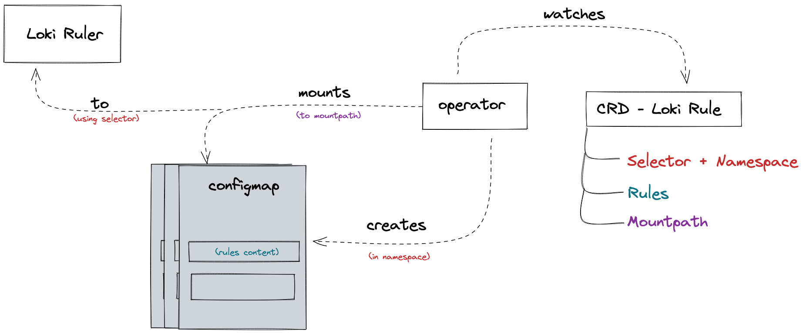

# Loki Rule Operator
Mounts and manages CRD provided rules to Loki Ruler Instances.

## Description
Loki Rule Operator utilizes Configmaps to mount rules provided by CRDs into loki ruler instances, the CRD must also contain selector and mountpath info. Loki ruler must be configured to use [local storage](https://grafana.com/docs/loki/latest/rules/#ruler-storage).


## Installing
We provide a helm-chart with all CRDs and manifests necessary for running the loki-rule-operator:

```bash
helm repo add queroedu https://quero-edu.github.io/loki-rule-operator
helm upgrade loki-rule-operator queroedu/loki-rule-operator --install
```

## Example
```yaml
apiVersion: quero.com/v1alpha1
kind: LokiRule
metadata:
  name: lokirule-sample
spec:
  name: sample-cfg # generated config map name
  selector: # loki ruler deployment selector labels
    matchLabels:
      app: loki
  mountPath: /tmp # loki ruler deployment mountpath
  data:
    test: |-
      Update test
```

## Licensing
Loki rule operator is licensed under the Apache License, Version 2.0. See LICENSE for the full license text.
