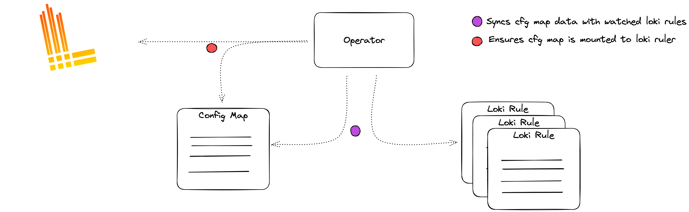

# Loki Rule Operator
Mounts and manages CRD provided rules to Loki Ruler Instances.

## Description
Loki Rule Operator mounts rules provided by CRDs into loki ruler instances via a configMap. Loki ruler must be configured to use [local storage](https://grafana.com/docs/loki/latest/rules/#ruler-storage).


## Installing
We provide a helm-chart with all CRDs and manifests necessary for running the loki-rule-operator:

```bash
helm repo add queroedu https://quero-edu.github.io/loki-rule-operator;

# provide values so the operator can find your loki deployment/rules path
helm upgrade loki-rule-operator queroedu/loki-rule-operator --install \
  --set lokiRuleOperator.lokiLabelSelector: "app.kubernetes.io/name=loki" \
  --set lokiRuleOperator.lokiNamespace: "default" \
  --set lokiRuleOperator.lokiRuleMountPath: "/etc/loki/rules"
```

## Example
```yaml
apiVersion: quero.com/v1alpha1
kind: LokiRule
metadata:
  name: lokirule-sample
spec:
  # rule groups should match the loki rule spec: https://grafana.com/docs/loki/latest/rules/
  groups:
    - name: my-rule-group
      rules:
        - alert: HighRequestLatency
          expr: rate({job="myjob"} |~ "request"[5m]) > 0.6
          for: 10m
          labels:
            severity: page
          annotations:
            summary: High request latency

```

## Licensing
Loki rule operator is licensed under the Apache License, Version 2.0. See LICENSE for the full license text.
